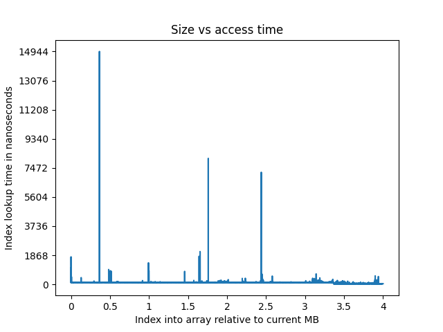

## L3 Side Channel - COMPX304 Assignment 1

#### Ethan McKee-Harris

---

#### Size based approaches

When attempting to timing based side channels, we need
some form of reliable size to base our data off. For my
example, I plan on using 1mb increments. By using a set 
scale, and ensuring we are actually only creating items 
of said size we can ensure that the data produced meets
the assumptions of our discussions and tests.

In Java an int takes up 4 bytes, we can then compute
the required size of an int array in order to reach our 
desired size. This is implemented as follows:

```java
    /**
     *
     * @param requestedSize How big in mb we want the array to be
     * @return int The required array size
     */
    public int getArraySizeFor(int requestedSize) {
        // Total items required for 1 mb
        int intByteToMb = 1000000 / 4;
        return intByteToMb * requestedSize;
    }
```

We can then utilise this return value to generate an array
of int's which meets the requested size.

```java
// psudocode
int size = getArraySizeFor(1);

// arr should now take up 1mb of memory
int[] arr = new int[size];
```

#### Looping tidbits

We loop with a step of `16` to hit a new cache line for
every iteration of my machine, you can find this out with
the command `getconf -a | grep CACHE` and looking at the 
relevant output.

#### Cache cleaning between loops

In order to ensure a reproducible environment we need
to remove the previous runs data from the l3 cache 
to not already have data 'pre-loaded' or interfering
with our next loop.


#### Initial approach

The initial approach consisted of timing each array lookup 
within the loop, an approach with produced far too many data
points for reliable graphing and computation.

This utilises a `System.gc()` call before we begin the loop,
however, there are otherwise no optimisations or changes to
things like the JIT. I believe this leads to some issues with
regardless to how reliable the data is due to Java possibly
compiling out some of our lookups if it determines its a no-op


